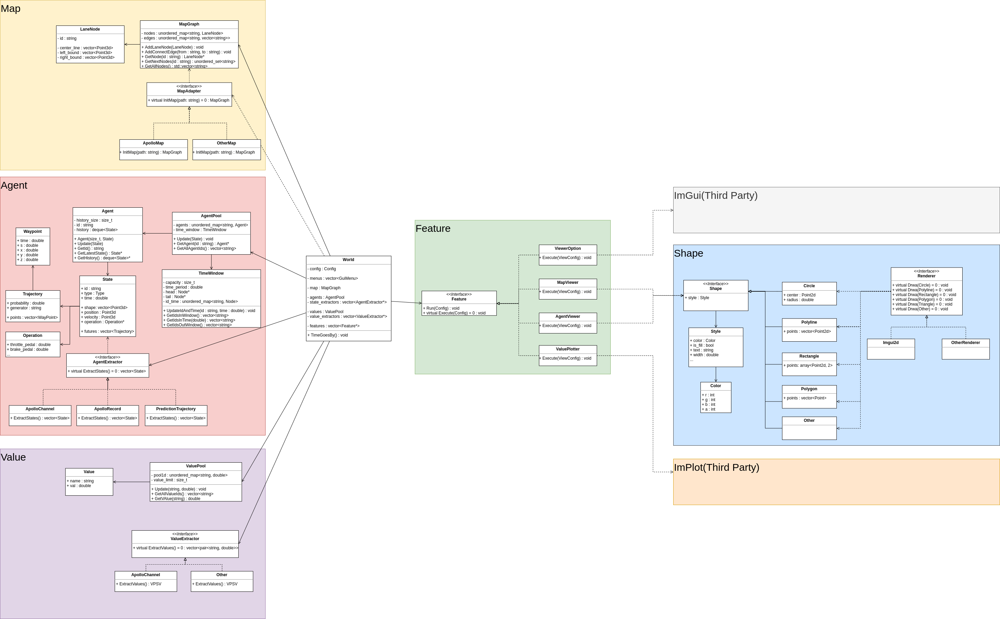

Autonomous-Visualization is a tool to visulize map and agents for self-driving(PnC) developers. It's based on two libraries:

- [Dear ImGui](https://github.com/ocornut/imgui)
- [ImPlot](https://github.com/epezent/implot)

Now the tool supports:

- Show hdmap(apollo) lane boundaries and reference line with ids;
- Show agents(ego vehicle and obstacles, extract from apollo channel) with history/shape/futures(planning or prediction trajectory);
- Show real time plot of vlaues(extracted from apollo channel)


# Build

## Dependence

### SDL2

```Bash
sudo apt install libsdl2-dev
```

### Apollo Cyber Module(for data extraction)

```Bash
git clone git@github.com:neolixcn/cyber.git &&
cd cyber &&
git checkout imu_integral_proto_update &&
bash build.sh build
```

## Build

```
git clone git@github.com:yongcongwang/autonomous-visualization.git &&
cd autonomous-visualization &&
mkdir build &&
cmake -Bbuild -H. &&
make -C build -$(nproc)
```

# Run
The executable will be generated in `autonomous-visualization/build`:

```Bash
./build/visulizer
```

If you want to display infos from apollo channel in LAN, you have to set the enviroment `CYBER_IP` to your true ip:

```Bash
export CYBER_IP=xxx.xxx.xxx.xxx
```

# Architecture

The `.png` picture is created by [Draw.io](https://app.diagrams.net/) you can re-edit the pic with that.



